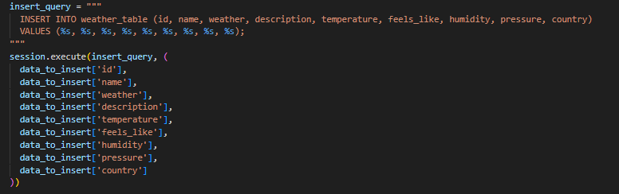

# Weather Data Crawling Project
This project aims to crawl weather data from the OpenWeather API https://openweathermap.org for cities in France and store the retrieved data in a Cassandra database. An API is also here to enable us to retrieve weather information from the database.

It implements the pipeline shown below:

## Project Overview
The project involves the following main components:

- Cassandra Database: A NoSQL database used to store weather data.
- Crawler Service: A Python service that crawls weather data from the OpenWeather API and stores it in the Cassandra database.
- Flask-Api Service: A Python service that reads from the database ans returns weather information based on API parameters.
- Docker Compose: Orchestration tool to manage the interaction between Cassandra and the Crawler service.
- Dockerfiles: Definitions for creating Docker containers for Cassandra and the Crawler service.

## Prerequisites
    - Docker
    - Docker Compose

## Components

### Cassandra
 - **Configuration**: The Cassandra database is containerized using the official Cassandra Docker image. It is configured to listen on port 9042 and is accessible through the cassandra hostname within the Docker network. A health check is added to ensure that the database is up and running before the Crawler begins inserting data.

 - **Initializaton**: the script *init_db.py* defines the function init_db that initializes the Cassandra keyspace and defines the schema for the table. The table schema includes columns to store various weather parameters, such as temperature, humidity, and more. 

Once we run this configuration, a keyspace *weather_db* and a table *weather_table* are created in the cassandra container. We can verify the creation using thr cqlsh command-line:

### Crawler Service
The Crawler service is responsible for fetching weather data from the OpenWeather API and storing it in the Cassandra database.

 - **Configuration**: the dockerfile in crawler folder is responsable of containerizing the Crawler service using a Python 3.6-slim image and ensuring the installion of necessary librabries and the availability of different scripts in the launched container.
 - **Crawling Logic**: The script *crawler.py* is the main script responsible of data crawling and insertion in the database. it has several functions:

 - **get_city_weather(city_id)**: Fetches weather data for a specific city ID from the OpenWeather API.
It utilizes the requests library to interact with the OpenWeather API. 
 - **get_France_cities_ids()**: The data is collected for cities located in France (based on city IDs from city.list.json).
 - **write_to_cassandra(session, data_to_insert)**: defines the used query resposable of inserting data in the database.

Once we crawel data from the API, we fetch the data to have it in a better format. We do this for the first 100 weather information and then insert it in the database. Once the crawler is runned, we have our table filled:

### Flask API Service
The API is responsible of fetching weather data for a specific city based on the provided city name.
 - **Configuration**: Same as Crawler service: containerizes the service using a Python 3.6-slim image and ensures the installion of necessary librabries and the availability of the script in the launched container.
 To make sure to not have connection problems, the API service musy wat for the Crawler service to successfully finish its job.

 

 - **Logic**: the *main.py* script in falsk-api folder sets up our API that enalbles to retrieve weather data for specific cities stored in a Cassandra database. When a client sends a GET request to the "`/weather`" route, the API extracts the requested city from the query parameter. It then performs a query on the Cassandra database, selecting weather-related information for the given city. This data is processed and transformed into a JSON response, containing details such as the city name, weather conditions, temperature, and more. It utilizes the Flask's request module for handling requests, and the cassandra.cluster module to connect to the Cassandra database.
 Once the container is launched, we have our API that is up:

 To test it, we juste send a request with the prefered city name, for example "Zutkerque" and we will receive different weather informaton related to this city.

 

## Execution
    - Open a terminal and navigate to the project directory.
    - Run docker-compose up to start the Cassandra database, Crawler and Flask api services.

